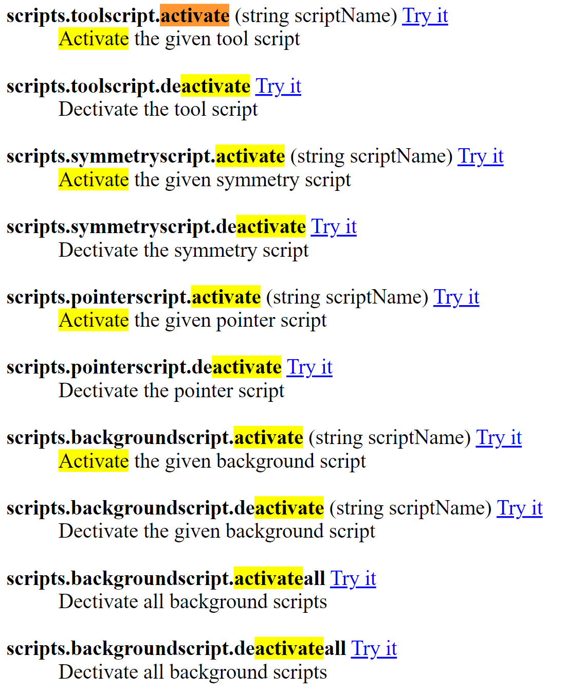

# LuaScriptExamples

Latest experiments-moonsharp builds for real-time scripting api branch:

https://nightly.link/IxxyXR/open-brush/workflows/build/experiments%2Fmoonsharp

---

[https://github.com/IxxyXR/open-brush/tree/experiments/moonsharp/Assets/Resources/LuaScriptExamples](https://github.com/IxxyXR/open-brush/tree/experiments/moonsharp/Assets/Resources/LuaScriptExamples)

Please direct all praise and blame at original author at link above, jk.
<br />
<br />
Some screenshots on how I got bootstrapped to start experimenting with the Realtime Scripting API in OB:

#### Coding in Visual Studio Code:


#### Finding example usage in existing examples:


#### Quick testing of Lua code outside of OB:


#### ChatGPT so you don't have to actually _learn_ anything:


#### Copy file from PC to Quest 2 (over USB C):


#### Activate / Deactivate scripts from command line:


```
ob scripts.toolscript.activate=xyz
ob scripts.toolscript.deactivate
```

#### Using adb to connect to logs on Quest 2:
https://docs.unity3d.com/Manual/android-debugging-on-an-android-device.html#view-android-logs

NOTE: when you first plug in your Quest 2 via USB, do NOT enable file sharing when prompted. To reset this, just unplug and plug the USBC C connection and then follow...

```
adb devices
adb tcpip 5555
adb connect 10.6.20.213:5555
 adb -s 10.6.20.213:5555 logcat
adb -s 10.6.20.213:5555 logcat | grep Unity
```


Once you're seeing logs, you can disconnect and reconnect USB C if necessary and enable file sharing so you can see Quest 2 in Windows Explorer for copying over Lua scripts.
