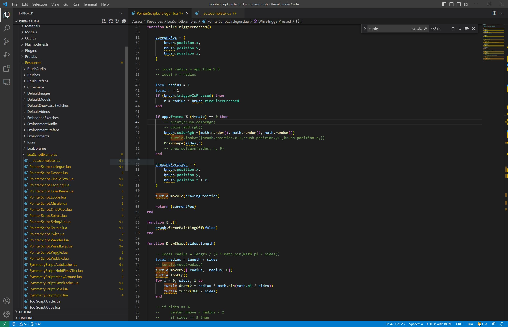
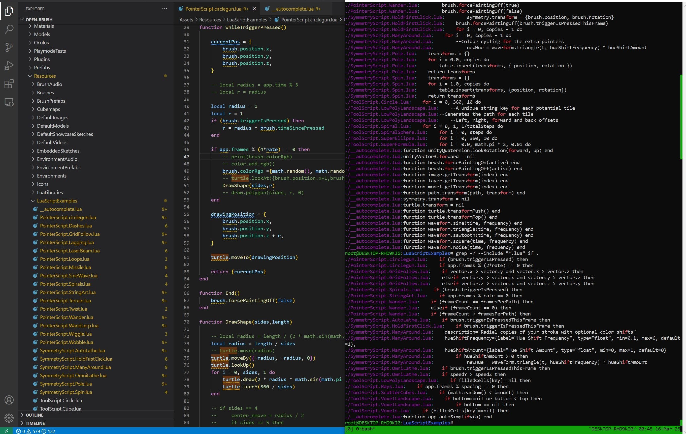
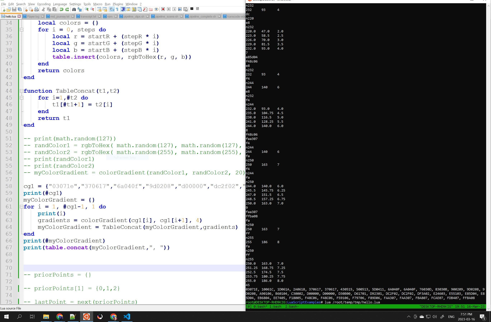
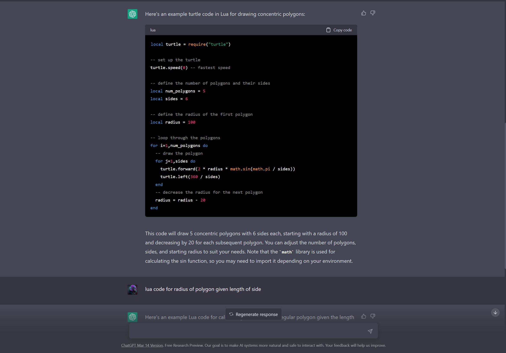
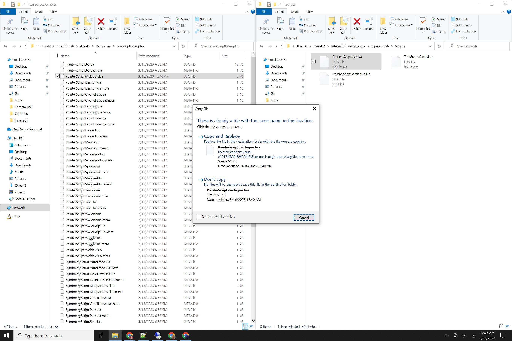

# LuaScriptExamples

Latest experiments-moonsharp builds for real-time scripting api branch:

https://nightly.link/IxxyXR/open-brush/workflows/build/experiments%2Fmoonsharp

---

[https://github.com/IxxyXR/open-brush/tree/experiments/moonsharp/Assets/Resources/LuaScriptExamples](https://github.com/IxxyXR/open-brush/tree/experiments/moonsharp/Assets/Resources/LuaScriptExamples)

Please direct all praise and blame at original author at link above, jk.
 
 
Some screenshots on how I got bootstrapped to start experimenting with the Realtime Scripting API in OB:

#### Coding in Visual Studio Code:

#### Finding example usage in existing examples:

#### Quick testing of Lua code outside of OB:

#### ChatGPT so you don't have to actually _learn_ anything:

#### Copy file from PC to Quest 2 (over USB C):

