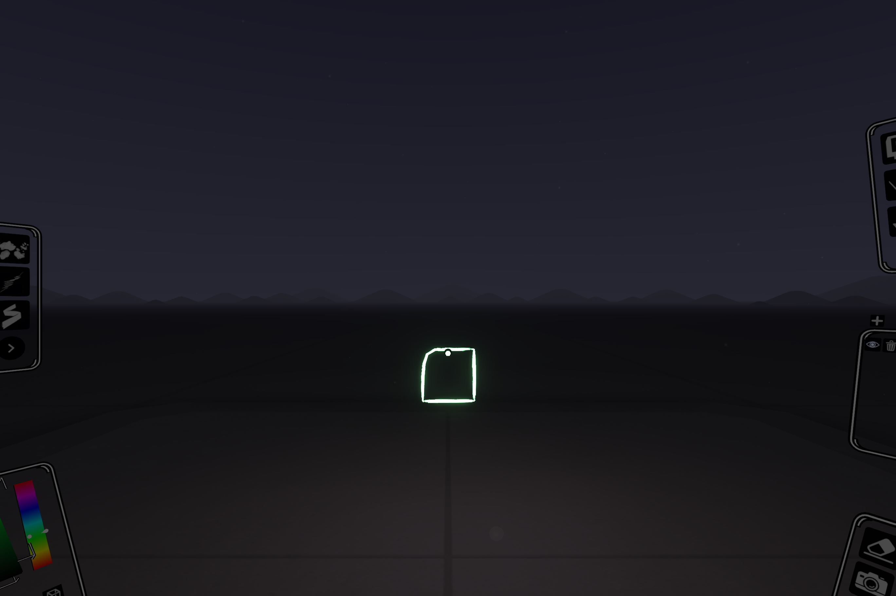
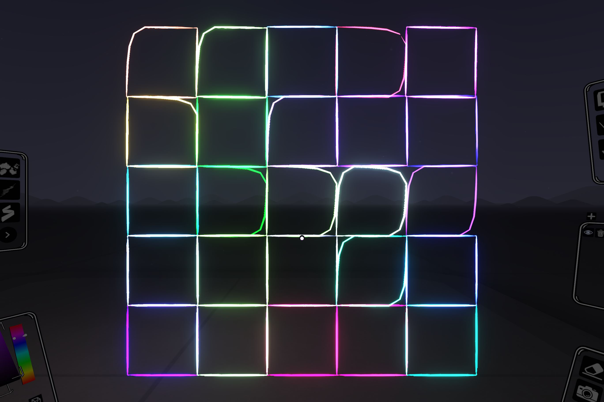

# Bug Reports

#### Explanation
draw.path is drawing a non linear square for certain sides when only four points are provided.
This is meant to be a square that is slightly rotated hence the non whole integer coordinates.

### Simple Example
```
curl --get --data-urlencode "draw.path=[-0.49,3,0],[0.51,3.01,0],[0.5,4.01,0],[-0.5,4,0],[-0.49,3,0]" \
  -v http://localhost:40074/api/v1
```


NOTE: square is perfectly linear when I use draw.path for individual sides with the exact same coordinates, where A,B,C,D are the x,y,z coordinates respectively, in the example above.

```
draw.path[A,B]
draw.path[B,C]
draw.path[C,D]
draw.path[D,A]
```

Discovered when I ran [../scripts/generative_art.html](../scripts/generative_art.html) --> drawCubicDisarray.

### 2nd Example
```
new
brush.move.to=0,0,0
brush.look.up
user.move.to=-4,10,10
color.set.html=4F04FC
draw.path=[-1,0,0],[1,0,0],[1,2,0],[-1,2,0],[-1,0,0]
color.set.html=8ECF90
draw.path=[1,0,0],[3,0,0],[3,2,0],[1,2,0],[1,0,0]
color.set.html=C9047A
draw.path=[3,0,0],[5,0,0],[5,2,0],[3,2,0],[3,0,0]
color.set.html=A61376
draw.path=[5,0,0],[7,0,0],[7,2,0],[5,2,0],[5,0,0]
color.set.html=05C6BF
draw.path=[7,0,0],[9,0,0],[9,2,0],[7,2,0],[7,0,0]
color.set.html=7693CA
draw.path=[-0.99,2,0],[1.01,2.01,0],[1,4.01,0],[-1,4,0],[-0.99,2,0]
color.set.html=7EBB5F
draw.path=[1.01,2,0],[3.01,2.01,0],[3,4.01,0],[1,4,0],[1.01,2,0]
color.set.html=373944
draw.path=[3,2,0],[5,2,0],[5,4,0],[3,4,0],[3,2,0]
color.set.html=21DDB9
draw.path=[4.99,2,0],[6.99,1.99,0],[7,3.99,0],[5,4,0],[4.99,2,0]
color.set.html=374CFD
draw.path=[7,2,0],[9,2,0],[9,4,0],[7,4,0],[7,2,0]
color.set.html=1CA0BD
draw.path=[-0.99,4,0],[1.01,4.01,0],[1,6.01,0],[-1,6,0],[-0.99,4,0]
color.set.html=016E11
draw.path=[0.99,4,0],[2.99,3.99,0],[3,5.99,0],[1,6,0],[0.99,4,0]
color.set.html=4A7C3D
draw.path=[2.99,4,0],[4.99,3.99,0],[5,5.99,0],[3,6,0],[2.99,4,0]
color.set.html=CDFFE9
draw.path=[4.99,4,0],[6.99,3.99,0],[7,5.99,0],[5,6,0],[4.99,4,0]
color.set.html=2C174B
draw.path=[6.99,4,0],[8.99,3.99,0],[9,5.99,0],[7,6,0],[6.99,4,0]
color.set.html=DAC34E
draw.path=[-1.02,6,0],[0.98,5.98,0],[1,7.98,0],[-1,8,0],[-1.02,6,0]
color.set.html=18E233
draw.path=[0.98,6,0],[2.98,5.98,0],[3,7.98,0],[1,8,0],[0.98,6,0]
color.set.html=8550C0
draw.path=[3.01,6,0],[5.01,6.01,0],[5,8.01,0],[3,8,0],[3.01,6,0]
color.set.html=4C23C4
draw.path=[5.02,6,0],[7.02,6.02,0],[7,8.02,0],[5,8,0],[5.02,6,0]
color.set.html=211C6B
draw.path=[7.02,6,0],[9.02,6.02,0],[9,8.02,0],[7,8,0],[7.02,6,0]
color.set.html=804B3F
draw.path=[-1.03,8,0],[0.97,7.97,0],[1,9.97,0],[-1,10,0],[-1.03,8,0]
color.set.html=ABFE8B
draw.path=[0.97,8,0],[2.97,7.97,0],[3,9.97,0],[1,10,0],[0.97,8,0]
color.set.html=304E92
draw.path=[3,8,0],[5,8,0],[5,10,0],[3,10,0],[3,8,0]
color.set.html=4E1924
draw.path=[4.98,8,0],[6.98,7.98,0],[7,9.98,0],[5,10,0],[4.98,8,0]
color.set.html=8229AE
draw.path=[6.97,8,0],[8.97,7.97,0],[9,9.97,0],[7,10,0],[6.97,8,0]
```

