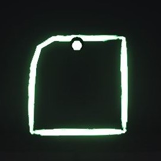
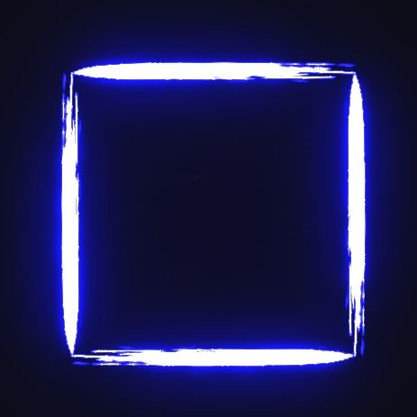
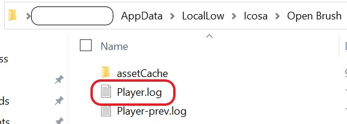

# API Commands List

[API Docs](./)


_This page was generated from the output directly from Open Brush API server. It's not always totally up to date. When you're running Open Brush then use the live commands list you get from_ [_http://localhost:40074/help/commands_](http://localhost:40074/help/commands) _as that will always be current._



_The "Try It" links assume that a version of Open Brush with API support is currently running on this computer. They won't work if Open Brush isn't running. You can run a_ [_monoscopic_ ](../../developer-notes/github-wiki/monoscopicmode.md)_version if you don't have a VR headset attached._


To run commands just send a request to this url with [http://localhost:40074/api/v1?](http://localhost:40074/api/v1?)

Commands are query string parameters. Like this: command.name=parameters

Separate multiple commands with: **&**&#x20;

Example:[ http://localhost:40074/api/v1?brush.turn.y=45\&brush.draw=1](http://localhost:40074/api/v1?brush.turn.y=45\&brush.draw=1)

If you want to send a lot of commands or especially long commands (complex paths etc) then you can just http POST instead of GET. The commands should be form-encoded in the body of the request (exactly as if you submitted a html form with the form name as the command name and the form value as the command parameters)

You can also send multiple requests although because of the nature of http, these can sometimes arrive in a different order to how yousent them. We will soon support websockets which should be a better way to send realtime streams of commands.

### Command List

**draw.paths** (string jsonString)[ Try it](http://localhost:40074/api/v1?draw.paths)

Draws a series of paths at the current brush position \[\[\[x1,y1,z1],\[x2,y2,z2], etc...]]. Does not move the brush position

___
**draw.path** (string jsonString)[ Try it](http://localhost:40074/api/v1?draw.path)

Draws a path at the current brush position \[\[x1,y1,z1],\[x2,y2,z2], etc...]. Does not move the brush position
___
NOTE: 
<br />
More importantly, draws a path RELATIVE to the current brush position.
```
move.to="1,1,0"
draw.path=[0,0,0],[1,0,0]
```
The above will draw a line segment from [1,1,0] to [2,1,0]
<br />
NOTE: brush.turn. will NOT change the default orientation during draw.path commands. You would use brush.draw for to draw in the direction where the brush x,y,z vectors point.
<br />
https://www.evl.uic.edu/ralph/508S98/coordinates.html#:~:text=The%20default%20coordinate%20system%20in%20OpenGL(TM)%20is%20right%2D,about%20the%20axis%20of%20rotation.
<br />
If you draw more than one line segment in a path, with 90 degree or "sharp turns", you may intermittently get non linear "connections". For e.g. here I intended to a draw square (ignore the "dot" from Monoscopic Mode):
```
draw.path=[0,0,0],[1,0,0],[1,1,0],[0,1,0],[0,0,0]
```


A proper square can consistently be acheived by drawing the individual line segments:
```
draw.path=[0,0,0],[1,0,0]
draw.path=[1,0,0],[1,1,0]
draw.path=[1,1,0],[0,1,0]
draw.path=[0,1,0],[0,0,0]
```

___


**draw.polygon** (int sides, float radius, float angle)[ Try it](http://localhost:40074/api/v1?draw.polygon=5,1,0)

Draws a polygon at the current brush position. Does not move the brush position

___
NOTE: 
<br />
angle is the "rotation" of the polygon, which becomes relevant when you have something like a square. A 45 degree angle is a square on its side, a 90 degree angle is a diamond.
<br />
___

**showfolder.scripts**[ Try it](http://localhost:40074/api/v1?showfolder.scripts)

Opens the user's Scripts folder on the desktop

**showfolder.exports**[ Try it](http://localhost:40074/api/v1?showfolder.exports)

Opens the user's Exports folder on the desktop

**draw.text** (string text)[ Try it](http://localhost:40074/api/v1?draw.text=hello)

Draws the characters supplied at the current brush position

**draw.svg** (string svgPathString)[ Try it](http://localhost:40074/api/v1?draw.svg=M%20184,199%20116,170%2053,209.6%2060,136.2%204.3,88)

Draws the path supplied as an SVG Path string at the current brush position

**brush.type** (string brushType)[ Try it](http://localhost:40074/api/v1?brush.type=ink)

Changes the brush. brushType can either be the brush name or it's guid. brushes are listed in the http://localhost:40074/help screen
___
NOTE: 
<br />
Different brushes will have different behaviour. For most brushes, if a draw.path line segment is too small, nothing will be drawn. However, the "Hull" brushes (ShinyHull,MatteHull,UnlitHull,Diamond) are able to preserve granularly smaller line segments.
<br />
```
new
brush.type=Light
sendcom draw.path=[-5,2,5],[-5.00001,2,5]
```
You will see NOTHING.

```
new
brush.type=ShinyHull
sendcom draw.path=[-5,2,5],[-5.00001,2,5]
```


___

**color.add.hsv** (Vector3 hsv)[ Try it](http://localhost:40074/api/v1?color.add.hsv=0.1,0.2,0.3)

Adds the supplied values to the current color. Values are hue, saturation and value

**color.add.rgb** (Vector3 rgb)[ Try it](http://localhost:40074/api/v1?color.add.rgb=0.1,0.2,0.3)

Adds the supplied values to the current color. Values are red green and blue
___
NOTE: 
RGB decimal values are between 0-1. If you have have an RGB values between 0-255, simply divide by 255.
<br />
For an explanation, google "rgb values less than 1".
___

**color.set.rgb** (Vector3 rgb)[ Try it](http://localhost:40074/api/v1?color.set.rgb=0.1,0.2,0.3)

Sets the current color. Values are hue, saturation and value

**color.set.hsv** (Vector3 hsv)[ Try it](http://localhost:40074/api/v1?color.set.hsv=0.1,0.2,0.3)

Sets the current color. Values are red, green and blue

**color.set.html** (string color)[ Try it](http://localhost:40074/api/v1?color.set.html=darkblue)

Sets the current color. colorString can either be a hex value or a css color name.

**brush.size.set** (float size)[ Try it](http://localhost:40074/api/v1?brush.size.set=.5)

Sets the current brush size

**brush.size.add** (float amount)[ Try it](http://localhost:40074/api/v1?brush.size.add=.1)

Changes the current brush size by 'amount'

**camera.move.to** (Vector3 position)[ Try it](http://localhost:40074/api/v1?camera.move.to=1,1,1)

Moves the spectator or non-VR camera to the given position

**camera.move.by** (Vector3 amount)[ Try it](http://localhost:40074/api/v1?camera.move.by=1,1,1)

Moves the spectator or non-VR camera by the given amount

**camera.turn.y** (float angle)[ Try it](http://localhost:40074/api/v1?camera.turn.y=45)

Turns the spectator or non-VR camera left or right.

**camera.turn.x** (float angle)[ Try it](http://localhost:40074/api/v1?camera.turn.x=45)

Changes the angle of the spectator or non-VR camera up or down.

**camera.turn.z** (float angle)[ Try it](http://localhost:40074/api/v1?camera.turn.z=45)

Tilts the angle of the spectator or non-VR camera clockwise or anticlockwise.

**camera.lookat** (Vector3 direction)[ Try it](http://localhost:40074/api/v1?camera.lookat=1,2,3)

Points the spectator or non-VR camera to look in the specified direction. Angles are given in x,y,z degrees

**brush.move.to** (Vector3 position)[ Try it](http://localhost:40074/api/v1?brush.move.to=1,1,1)

Moves the brush to the given coordinates

**brush.move.by** (Vector3 offset)[ Try it](http://localhost:40074/api/v1?brush.move.by=1,1,1)

Moves the brush by the given amount

**brush.move** (float distance)[ Try it](http://localhost:40074/api/v1?brush.move=1)

Moves the brush forward by 'distance' without drawing a line

**brush.draw** (float distance)[ Try it](http://localhost:40074/api/v1?brush.draw=1)

Moves the brush forward by 'distance' and draws a line

**brush.turn.y** (float angle)[ Try it](http://localhost:40074/api/v1?brush.turn.y=45)

Changes the brush direction to the left or right. Angle is measured in degrees

**brush.turn.x** (float angle)[ Try it](http://localhost:40074/api/v1?brush.turn.x=45)

Changes the brush direction up or down. Angle is measured in degrees

**brush.turn.z** (float angle)[ Try it](http://localhost:40074/api/v1?brush.turn.z=45)

Rotates the brush clockwise or anticlockwise. Angle is measured in degrees

**brush.lookat** (Vector3 direction)[ Try it](http://localhost:40074/api/v1?brush.lookat=1,1,1)

Changes the brush direction to look at the specified point

**brush.look.forwards**[ Try it](http://localhost:40074/api/v1?brush.look.forwards)

Changes the brush direction to look forwards

**brush.look.up**[ Try it](http://localhost:40074/api/v1?brush.look.up)

Changes the brush direction to look upwards

**brush.look.down**[ Try it](http://localhost:40074/api/v1?brush.look.down)

Changes the brush direction to look downwards

**brush.look.left**[ Try it](http://localhost:40074/api/v1?brush.look.left)

Changes the brush direction to look to the left

**brush.look.right**[ Try it](http://localhost:40074/api/v1?brush.look.right)

Changes the brush direction to look to the right

**brush.look.backwards**[ Try it](http://localhost:40074/api/v1?brush.look.backwards)

Changes the brush direction to look backwards

**brush.home**[ Try it](http://localhost:40074/api/v1?brush.home)

Resets the brush position and direction

**brush.home.set**[ Try it](http://localhost:40074/api/v1?brush.home.set)

Sets the current brush position and direction as the new home

**brush.transform.push**[ Try it](http://localhost:40074/api/v1?brush.transform.push)

Stores the current brush position and direction on to a stack

**brush.transform.pop**[ Try it](http://localhost:40074/api/v1?brush.transform.pop)

Pops the most recent current brush position and direction from the stack

**debug.brush**[ Try it](http://localhost:40074/api/v1?debug.brush)

Logs some info about the brush
___
NOTE: 
<br />
C:\Users\YOUR_USERNAME\AppData\LocalLow\Icosa\Open Brush\Player.log



___


**stroke.delete** (int index)[ Try it](http://localhost:40074/api/v1?stroke.delete=0)

Delete strokes by their index. If index is 0 the most recent stroke is deleted. -1 etc steps back in time

**stroke.select** (int index)[ Try it](http://localhost:40074/api/v1?stroke.select=0)

Selects a stroke by it's index. 0 is the most recent stroke, -1 is second to last, 1 is the first.

**strokes.select** (int start, int end)[ Try it](http://localhost:40074/api/v1?strokes.select=0,3)

Select multiple strokes by their index. 0 is the most recent stroke, -1 is second to last, 1 is the first.

**selection.recolor**[ Try it](http://localhost:40074/api/v1?selection.recolor)

Recolors the currently selected strokes

**selection.rebrush**[ Try it](http://localhost:40074/api/v1?selection.rebrush)

Rebrushes the currently selected strokes

**selection.resize**[ Try it](http://localhost:40074/api/v1?selection.resize)

Changes the brush size the currently selected strokes

**selection.trim** (int count)[ Try it](http://localhost:40074/api/v1?selection.trim=2)

Removes a number of points from the currently selected strokes

**selection.points.addnoise** (string axis, Vector3 scale)[ Try it](http://localhost:40074/api/v1?selection.points.addnoise=x,0.5)

Moves the position of all control points in the selection using a noise function

**selection.points.quantize** (Vector3 grid)[ Try it](http://localhost:40074/api/v1?selection.points.quantize=0.1)

Snaps all the points in selected strokes to a grid (buggy)

**stroke.join**[ Try it](http://localhost:40074/api/v1?stroke.join)

Joins a stroke with the previous one

**strokes.join** (int start, int end)[ Try it](http://localhost:40074/api/v1?strokes.join=0,2)

Joins all strokes between the two indices (inclusive)

**stroke.add** (int index)[ Try it](http://localhost:40074/api/v1?stroke.add=0)

Adds a point at the current brush position to the specified stroke

**import.model** (string path)[ Try it](http://localhost:40074/api/v1?import.model=example.glb)

Imports a model from your media libraries Models folder

**tool.sketchsurface**[ Try it](http://localhost:40074/api/v1?tool.sketchsurface)

Activates the SketchSurface

**tool.selection**[ Try it](http://localhost:40074/api/v1?tool.selection)

Activates the Selection Tool

**tool.colorpicker**[ Try it](http://localhost:40074/api/v1?tool.colorpicker)

Activates the Color Picker

**tool.brushpicker**[ Try it](http://localhost:40074/api/v1?tool.brushpicker)

Activates the Brush Picker

**tool.brushandcolorpicker**[ Try it](http://localhost:40074/api/v1?tool.brushandcolorpicker)

Activates the Brush And Color Picker

**tool.sketchorigin**[ Try it](http://localhost:40074/api/v1?tool.sketchorigin)

Activates the SketchOrigin Tool

**tool.autogif**[ Try it](http://localhost:40074/api/v1?tool.autogif)

Activates the AutoGif Tool

**tool.canvas**[ Try it](http://localhost:40074/api/v1?tool.canvas)

Activates the Canvas Tool

**tool.transform**[ Try it](http://localhost:40074/api/v1?tool.transform)

Activates the Transform Tool

**tool.stamp**[ Try it](http://localhost:40074/api/v1?tool.stamp)

Activates the Stamp Tool

**tool.freepaint**[ Try it](http://localhost:40074/api/v1?tool.freepaint)

Activates the FreePaint Tool

**tool.eraser**[ Try it](http://localhost:40074/api/v1?tool.eraser)

Activates the Eraser Tool

**tool.screenshot**[ Try it](http://localhost:40074/api/v1?tool.screenshot)

Activates the Screenshot Tool

**tool.dropper**[ Try it](http://localhost:40074/api/v1?tool.dropper)

Activates the Dropper Tool

**tool.saveicon**[ Try it](http://localhost:40074/api/v1?tool.saveicon)

Activates the SaveIcon Tool

**tool.threedofviewing**[ Try it](http://localhost:40074/api/v1?tool.threedofviewing)

Activates the ThreeDofViewing Tool

**tool.multicam**[ Try it](http://localhost:40074/api/v1?tool.multicam)

Activates the MultiCam Tool

**tool.teleport**[ Try it](http://localhost:40074/api/v1?tool.teleport)

Activates the Teleport Tool

**tool.repaint**[ Try it](http://localhost:40074/api/v1?tool.repaint)

Activates the Repaint Tool

**tool.recolor**[ Try it](http://localhost:40074/api/v1?tool.recolor)

Activates the Recolor Tool

**tool.rebrush**[ Try it](http://localhost:40074/api/v1?tool.rebrush)

Activates the Rebrush Tool

**tool.pin**[ Try it](http://localhost:40074/api/v1?tool.pin)

Activates the Pin Tool

**tool.camerapath**[ Try it](http://localhost:40074/api/v1?tool.camerapath)

Activates the CameraPath Tool

**tool.fly**[ Try it](http://localhost:40074/api/v1?tool.fly)

Activates the Fly Tool

**save.overwrite**[ Try it](http://localhost:40074/api/v1?save.overwrite)

Save the current scene overwriting the last save if it exists

**save**[ Try it](http://localhost:40074/api/v1?save)

Saves the current scene in a new slot

**export.all**[ Try it](http://localhost:40074/api/v1?export.all)

Exports all the scenes in the users's sketch folder

**drafting.visible**[ Try it](http://localhost:40074/api/v1?drafting.visible)

Shows all strokes made with the drafting brush fully opaque

**drafting.transparent**[ Try it](http://localhost:40074/api/v1?drafting.transparent)

Shows all strokes made with the drafting brush semi-transparent

**drafting.hidden**[ Try it](http://localhost:40074/api/v1?drafting.hidden)

Hides all strokes made with the drafting brush

**load.user** (int slot)[ Try it](http://localhost:40074/api/v1?load.user=0)

Loads the sketch in the given slot number from the user's sketch folder

**load.curated** (int slot)[ Try it](http://localhost:40074/api/v1?load.curated=0)

Loads the sketch in the given slot number from the curated sketch list

**load.liked** (int slot)[ Try it](http://localhost:40074/api/v1?load.liked=0)

Loads the sketch in the given slot number from the user's liked sketches

**load.drive** (int slot)[ Try it](http://localhost:40074/api/v1?load.drive=0)

Loads the sketch in the given slot number from the user's Google Drive

**load.named** (string filename)[ Try it](http://localhost:40074/api/v1?load.named=mysketch.sketch)

Loads the sketch with the given name from the user's sketch folder

**new**[ Try it](http://localhost:40074/api/v1?new)

Clears the current sketch

**symmetry.mirror**[ Try it](http://localhost:40074/api/v1?symmetry.mirror)

Sets the symmetry mode to 'mirror'

**symmetry.doublemirror**[ Try it](http://localhost:40074/api/v1?symmetry.doublemirror)

Sets the symmetry mode to 'double mirror'

**straightedge.toggle**[ Try it](http://localhost:40074/api/v1?straightedge.toggle)

Toggles the straight edge tool on or off

**autoorient.toggle**[ Try it](http://localhost:40074/api/v1?autoorient.toggle)

Toggles autoorientate on or off

**undo**[ Try it](http://localhost:40074/api/v1?undo)

Undoes the last action

**redo**[ Try it](http://localhost:40074/api/v1?redo)

Redo the last action

**panels.reset**[ Try it](http://localhost:40074/api/v1?panels.reset)

Reset the position of all panels

**sketch.origin**[ Try it](http://localhost:40074/api/v1?sketch.origin)

Enables the sketch origin tool

**viewonly.toggle**[ Try it](http://localhost:40074/api/v1?viewonly.toggle)

Toggles 'view only' mode on or off

**dropcam.toggle**[ Try it](http://localhost:40074/api/v1?dropcam.toggle)

Toggles the Drop Cam widget on or off

**autosimplify.toggle**[ Try it](http://localhost:40074/api/v1?autosimplify.toggle)

Toggles 'auto-simplify' mode on or off

**export**[ Try it](http://localhost:40074/api/v1?export)

Exports the current sketch to the user's Exports folder

**showfolder.sketch** (int index)[ Try it](http://localhost:40074/api/v1?showfolder.sketch=0)

Opens the user's Sketches folder on the desktop

**stencils.disabled**[ Try it](http://localhost:40074/api/v1?stencils.disabled)

Disables all stencils

**disco**[ Try it](http://localhost:40074/api/v1?disco)

Starts a party

**selection.duplicate**[ Try it](http://localhost:40074/api/v1?selection.duplicate)

Create a duplicate of the current selection

**selection.group**[ Try it](http://localhost:40074/api/v1?selection.group)

Groups the current selection

**export.selected**[ Try it](http://localhost:40074/api/v1?export.selected)

Exports the selected strokes to the user's Media Library

**camerapath.render**[ Try it](http://localhost:40074/api/v1?camerapath.render)

Renders the current camera path to a video

**profiling.toggle**[ Try it](http://localhost:40074/api/v1?profiling.toggle)

Toggles profiling mode on or off

**settings.toggle**[ Try it](http://localhost:40074/api/v1?settings.toggle)

Toggles the settings panel on or off

**mirror.summon**[ Try it](http://localhost:40074/api/v1?mirror.summon)

Summons the mirror origin to the user's position

**selection.invert**[ Try it](http://localhost:40074/api/v1?selection.invert)

Inverts the current selection

**select.all**[ Try it](http://localhost:40074/api/v1?select.all)

Selects all strokes and widgets in the scene

**selection.flip**[ Try it](http://localhost:40074/api/v1?selection.flip)

Mirrors the current selection

**postprocessing.toggle**[ Try it](http://localhost:40074/api/v1?postprocessing.toggle)

Toggles post-processing effects on or off

**watermark.toggle**[ Try it](http://localhost:40074/api/v1?watermark.toggle)

Toggles the watermark on or off

**camerapath.togglevisuals**[ Try it](http://localhost:40074/api/v1?camerapath.togglevisuals)

Toggles the camera path visuals on or off

**camerapath.togglepreview**[ Try it](http://localhost:40074/api/v1?camerapath.togglepreview)

Toggles the camera path preview on or off

**camerapath.delete**[ Try it](http://localhost:40074/api/v1?camerapath.delete)

Deletes the current camera path

**camerapath.record**[ Try it](http://localhost:40074/api/v1?camerapath.record)

Starts recording a camera path