Original Source: https://github.com/JakobGlock/Generative-Art

```
source ~/venv_3.6.8/bin/activate
# IF NOT LOCALHOST
export OB_HOST="10.0.2.2"
```

python3 Line_Grid.py
-------------
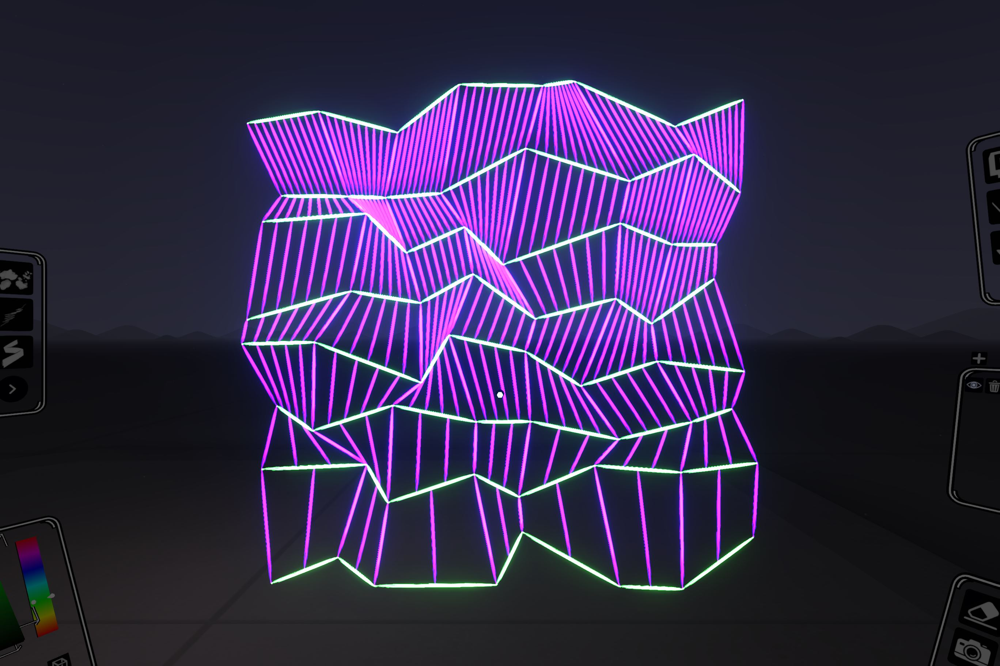 | 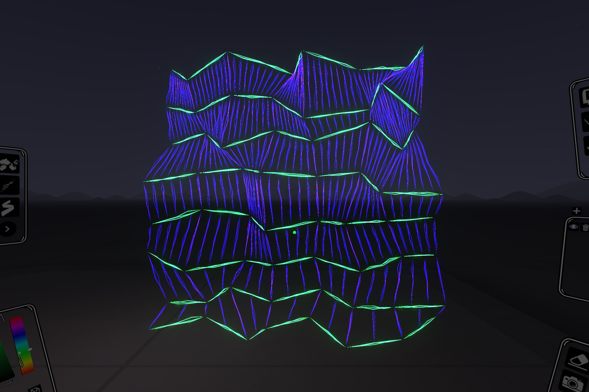

python3 Parallel_Lines.py
-------------
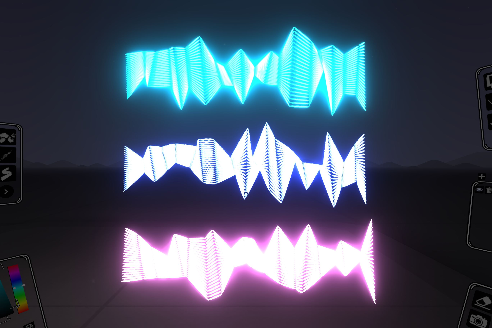 | 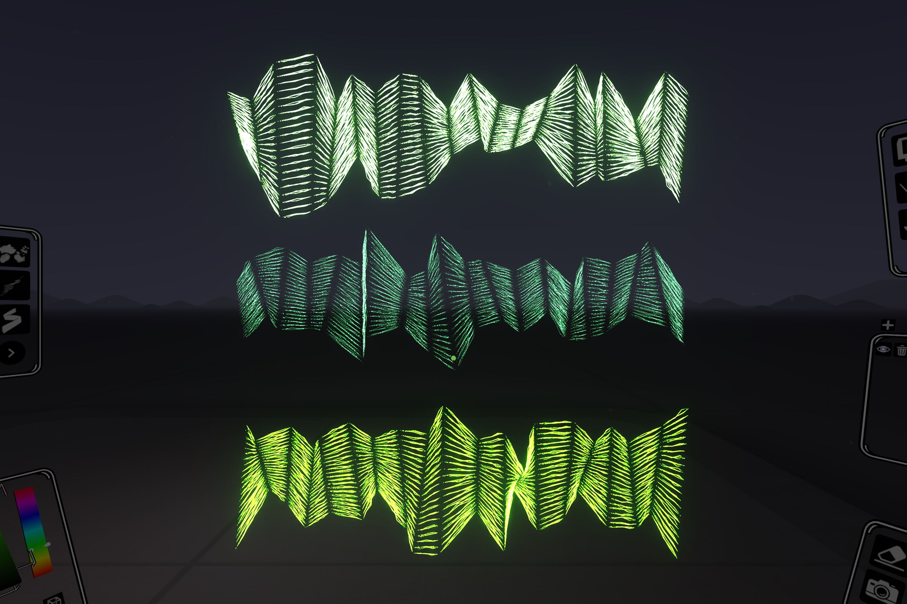

python3 Circular.py
-------------
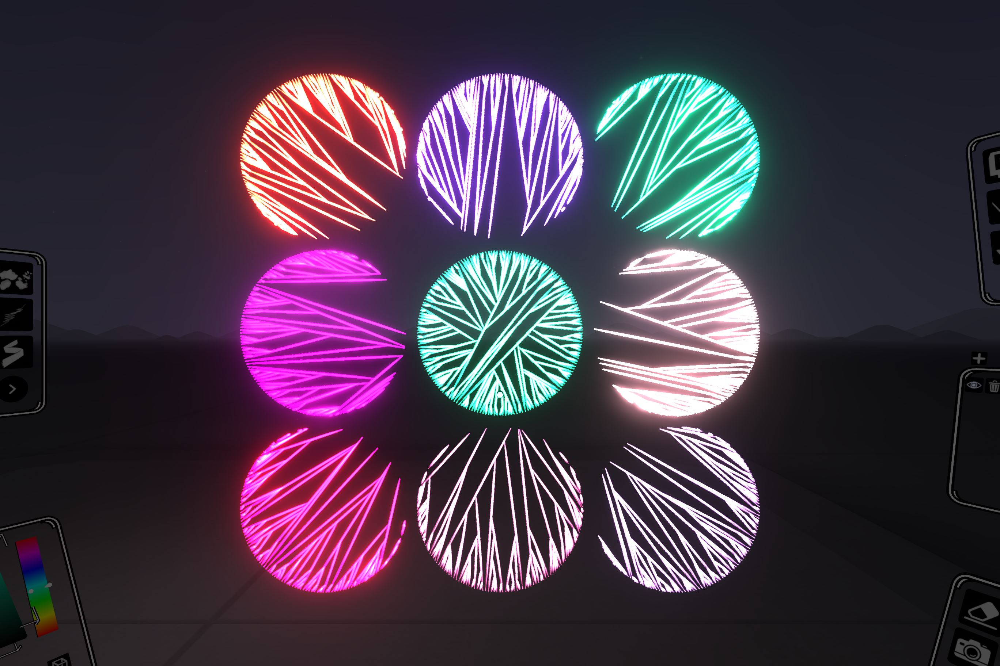 | 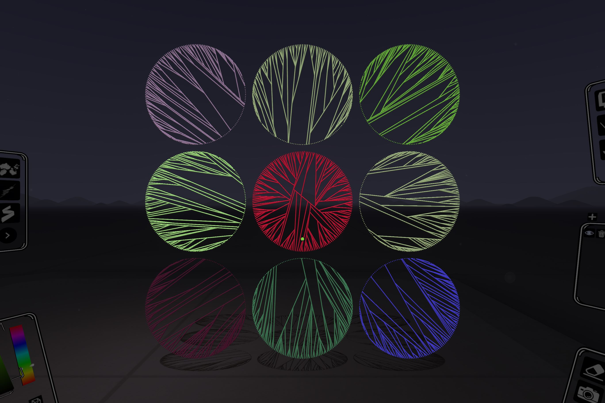

python3 Line_Walker.py
-------------
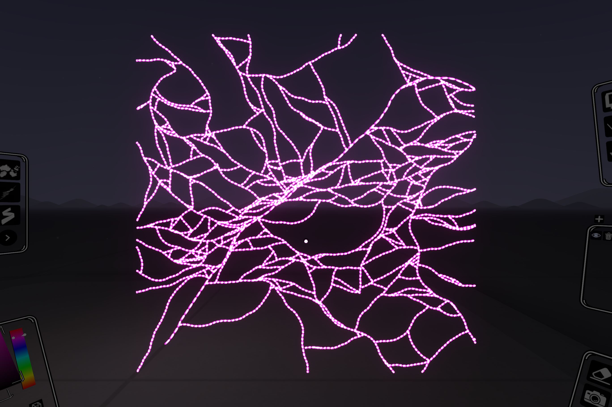  | 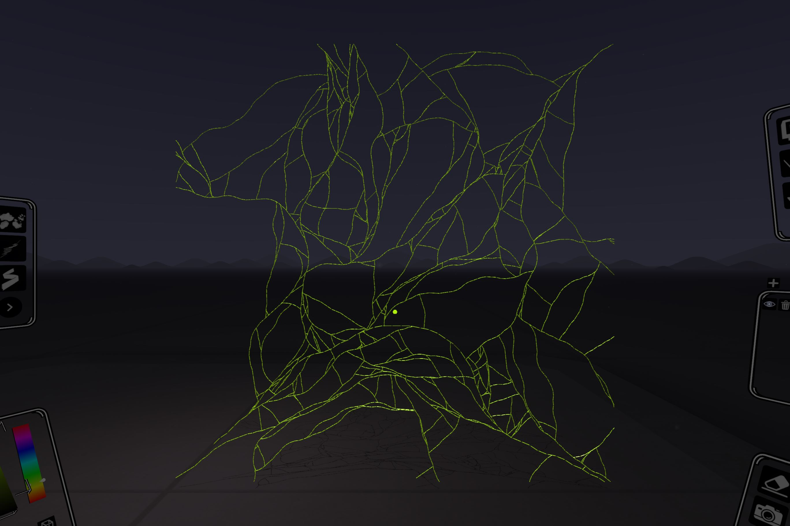  

python3 Mosaic_Circles.py
-------------
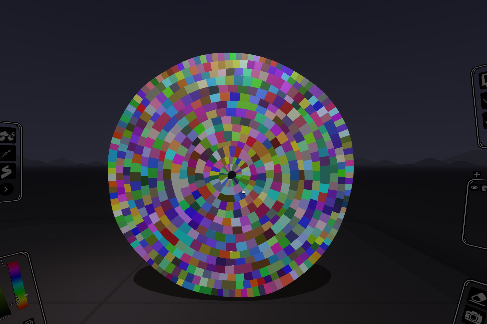 |   

python3 Offset_Quads.py
-------------
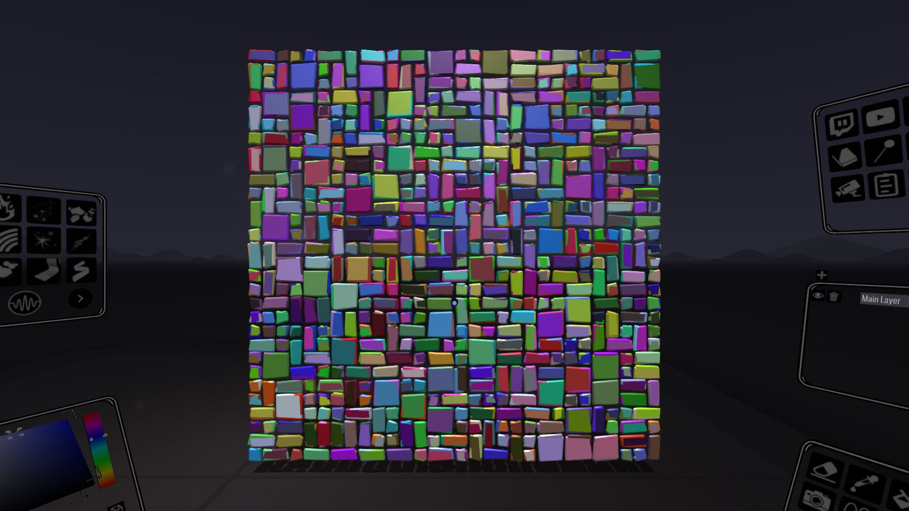 | 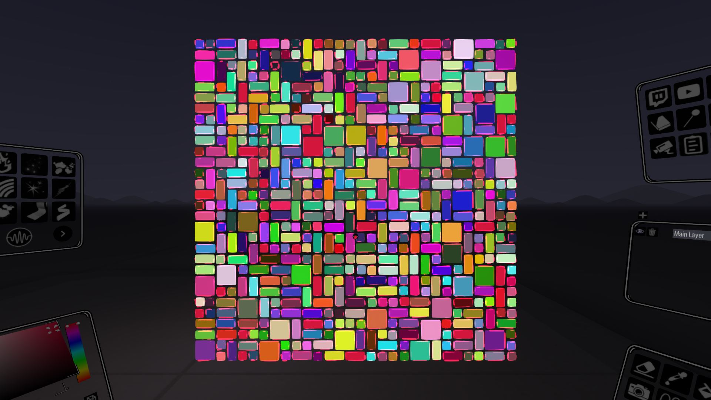

python3 Masonry.py
-------------
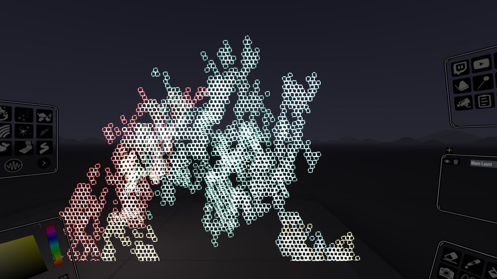 | 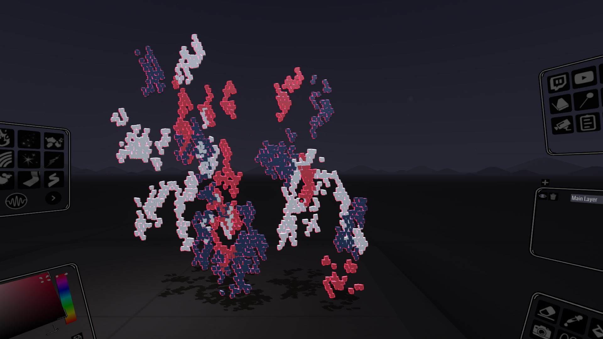

python3 Perlin_Brush_Stroke.py
-------------
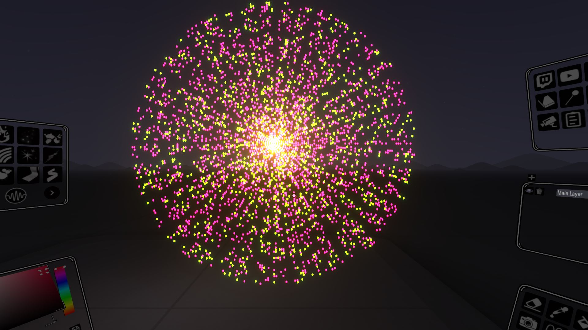 | 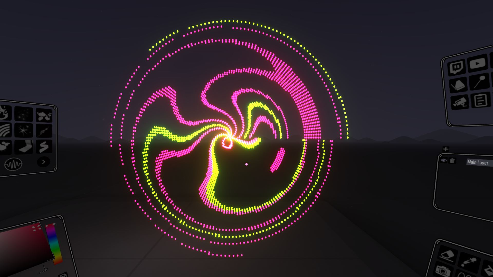


```
"Line_Walker"
# takes long, do on its own, speed up
"Masonry"
"Offset_Quads" 

python3 Line_Grid.py
python3 Mosaic_Circles.py
python3 Parallel_Lines.py
python3 Circular.py
python3 Magnetic_Flow.py
python3 Masonry.py
python3 Offset_Quads.py

declare -a arr=("Line_Grid" "Mosaic_Circles" "Parallel_Lines" "Perlin_Brush_Stroke" "Circular" "Magnetic_Flow" )
for i in "${arr[@]}"
do
  python3 ${i}.py
  sleep 5
done

```