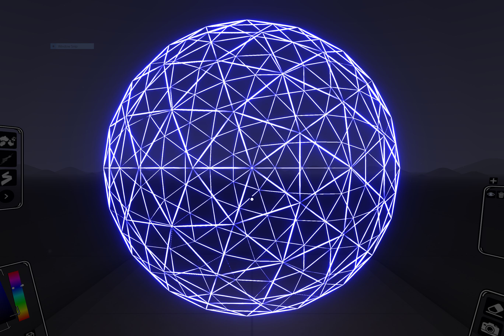
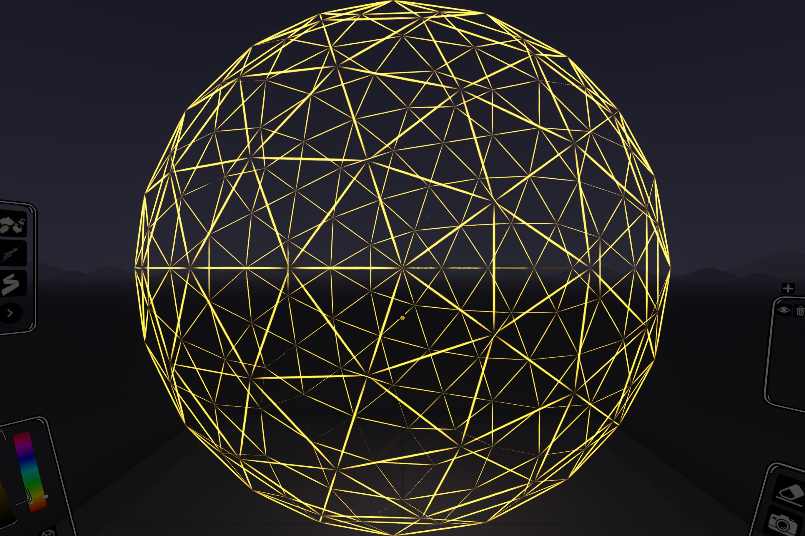
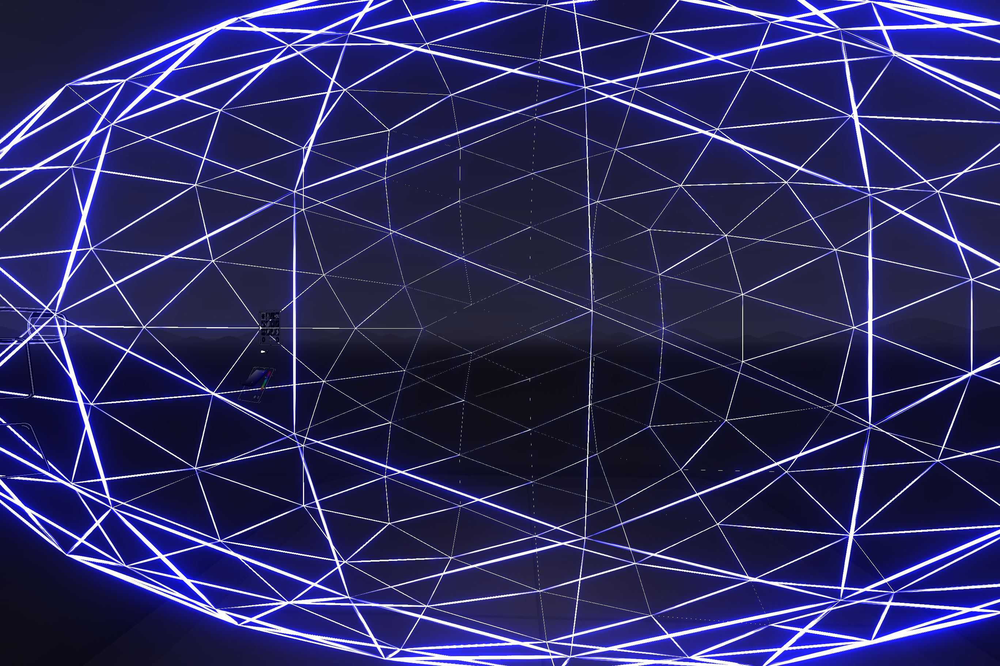

# geoDome

Original Source: https://github.com/antiprism/dome-4.80ar

```
autoreconf -v -i -W all
./configure
make
./src/dome -f4 -s output.OFF
cp output.OFF output.OFF_4
```
NOTE: output.OFF_4 is the dome data output of the C program above<br />

Watch it twirl with the spectator camera: [http://localhost:40074/examplescripts/spectator.html](http://localhost:40074/examplescripts/spectator.html)

python3 geoDome.py
-------------
 | 

python3 geoDome.py output.OFF_4 
-------------

