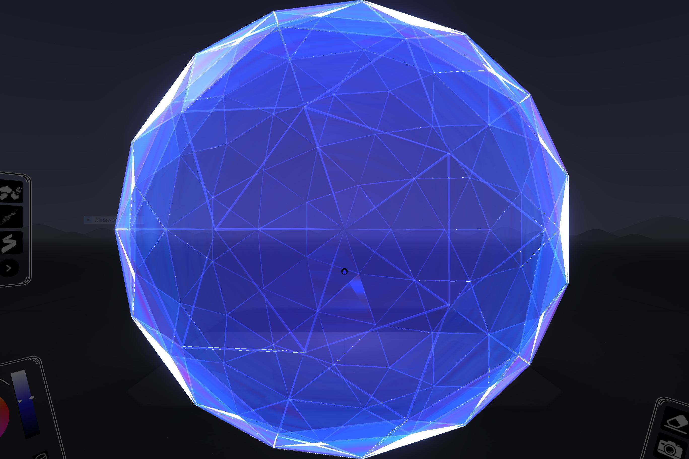
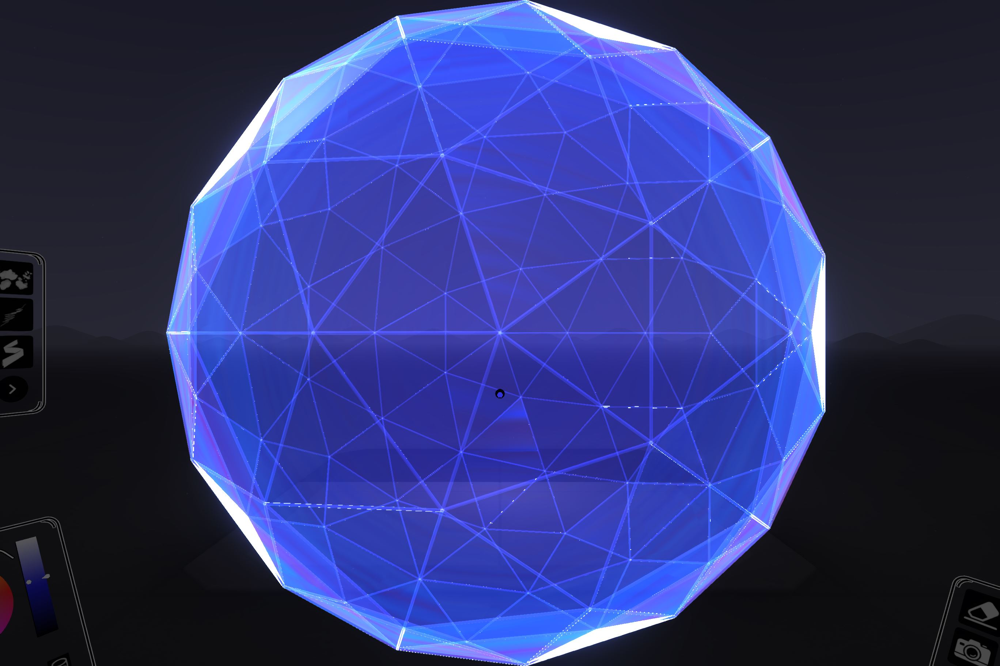
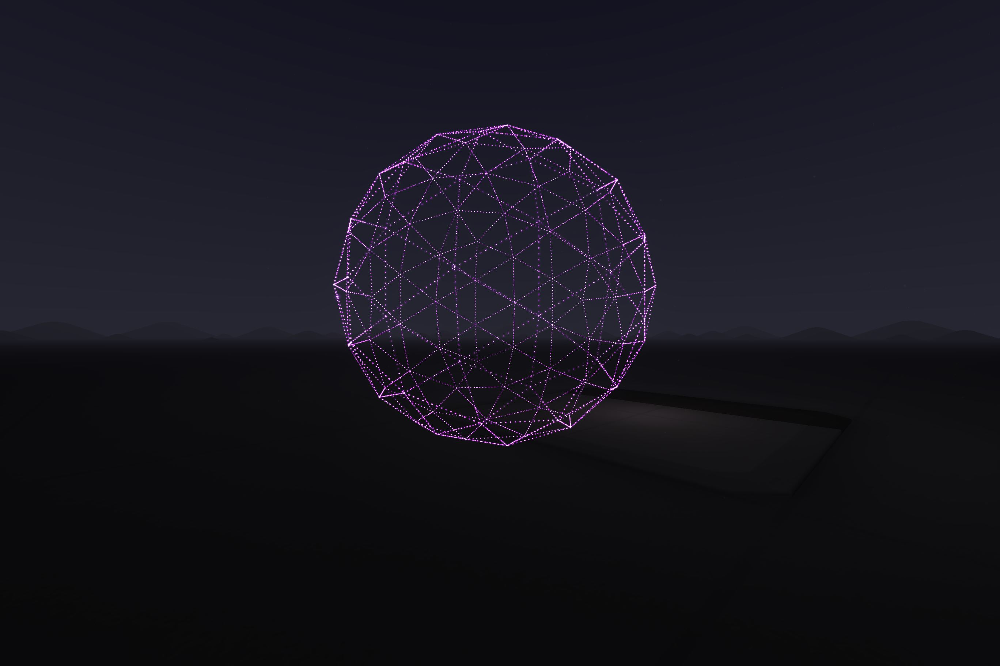

# geoDome

Original Source: https://github.com/antiprism/dome-4.80ar

```
autoreconf -v -i -W all
./configure
make
./src/dome -f4 -s output.OFF
cp output.OFF output.OFF_4

source ~/venv_3.8/bin/activate
# IF NOT LOCALHOST
export OB_HOST="10.0.2.2"
```
NOTE: output.OFF_4 is the dome data output of the C program above<br />

Watch it twirl with the spectator camera: [http://localhost:40074/examplescripts/spectator.html](http://localhost:40074/examplescripts/spectator.html)

python3 geoDome.py
-------------
 | 

python3 geoDome.py output.OFF_4
-------------


python3 geoDome.py output.OFF_3
-------------
 | 

The difference above is simply draw.path=A,B,C vs draw.path=A,B,C,A. The second results in flush flat surfaces. More visible with headset.

