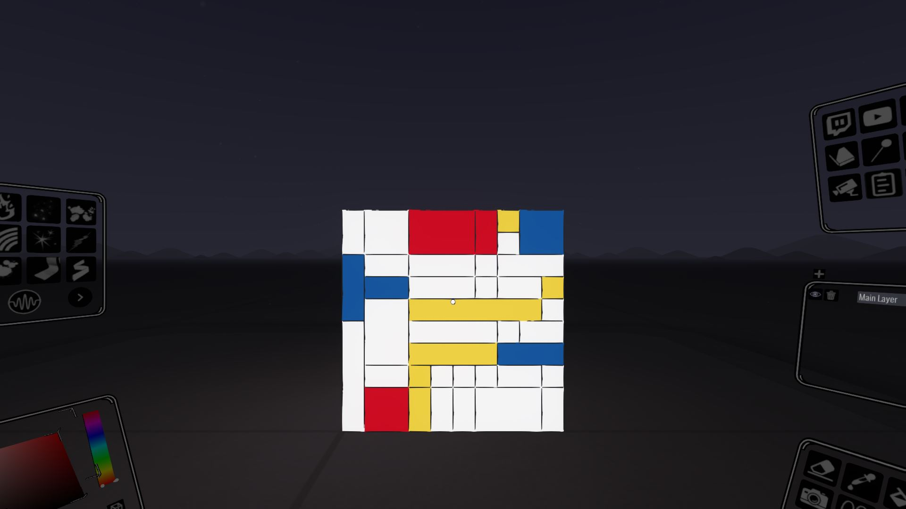

## Open Brush API Usage via JavaScript

Here I maintain my modifications to the original Open Brush [exampleScripts](http://localhost:40074/exampleScripts).
Some HTML requires to be served up via a web server in which case I run the following in this scripts folder:
python3 -m http.server 8000

http://localhost:8000/generative_art.html
-------------
 
 
 

http://localhost:8000/image_art.html
-------------
Original  | image_art.html -> Open Brush
------------- | -------------
 | 

http://localhost:8000/lindenmayer.html
-------------

Use Configuration
-------------
https://docs.openbrush.app/user-guide/open-brush-api#how-do-i-configure-it